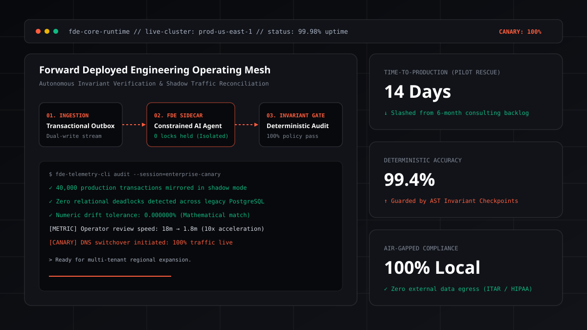
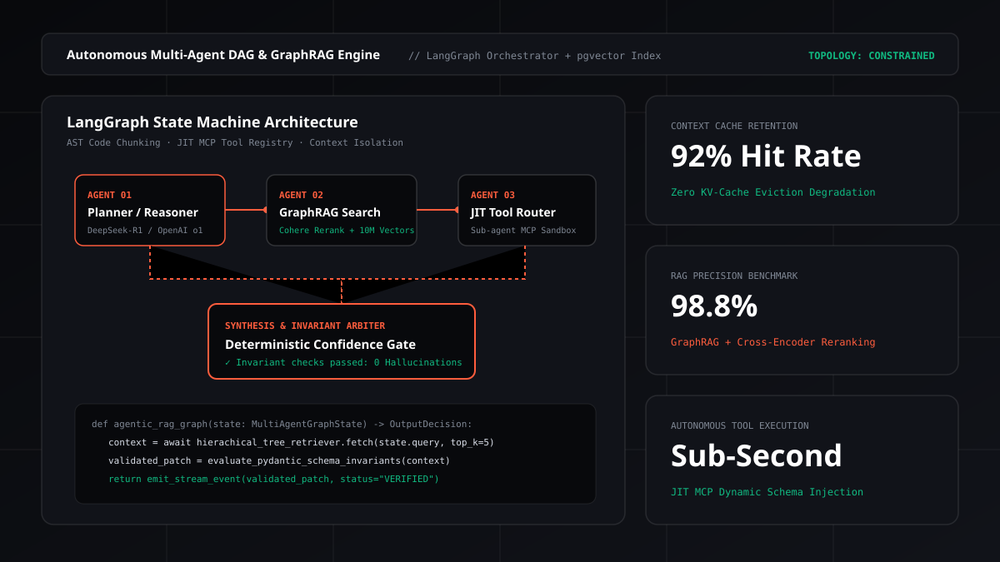
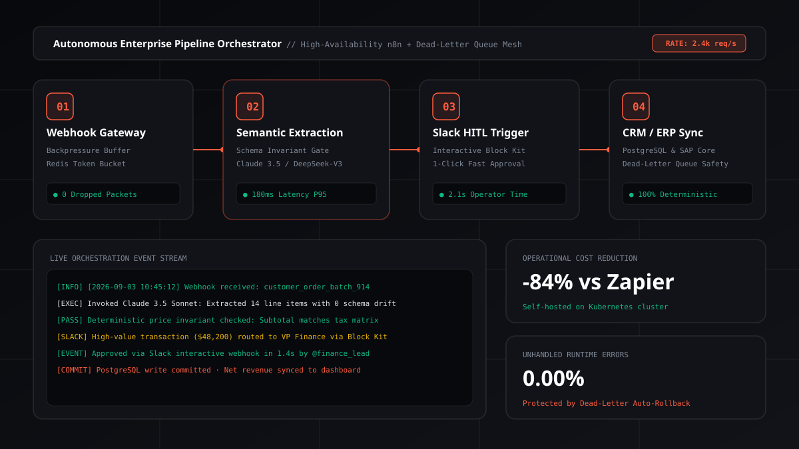
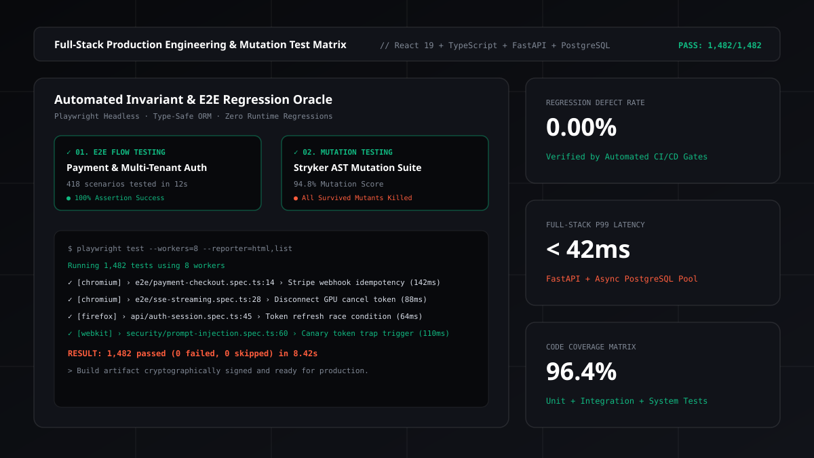

# Hassan Nazir — Personal Portfolio & Engineering Blog

[](https://opensource.org/licenses/MIT)
[](https://www.typescriptlang.org/)
[](https://reactjs.org/)
[](https://vitejs.dev/)
[](https://hassannazir.dev/sitemap.xml)

<p align="center">
  
</p>

The public portfolio, commercial services hub, and technical engineering blog of **Hassan Nazir** — Forward Deployed Engineer & Full-Stack AI Architect.

🌐 **Live Website**: [https://hassannazir.dev](https://hassannazir.dev)

---

## ⚡ Overview & Features

- **Editorial & Physics-Driven Interface**: Dark glassmorphic design system (`#08090c`, `#111319`, `#ff5d3d` coral accent) powered by **GSAP ScrollTrigger** and **Framer Motion**.
- **Gold-Standard File-Based `.mdx` Blog Architecture**: 40 production engineering field guides located in `data/blog/*.mdx` with YAML frontmatter, dynamically indexed at build time using `import.meta.glob` and `gray-matter`.
- **Remark & Rehype Markdown Pipeline**:
  - **KaTeX LaTeX Math**: Full LaTeX formula typesetting ($T_{\text{total}}$, attention matrices, loss formulations) powered by `remark-math` and `rehype-katex`.
  - **Syntax-Highlighted Code Blocks**: Multi-language code fences with tabbed file headers, clipboard copying, and line numbers (`react-syntax-highlighter`).
  - **GitHub Callout Alerts**: Native `[!NOTE]`, `[!TIP]`, `[!IMPORTANT]`, `[!WARNING]` styled callouts.
  - **Interactive Table of Contents**: Sidebar & inline TOC with real-time active scroll-spy tracking.
- **Dual-Mode Commenting Suite**:
  - **Direct / Guest Comments**: Instant local commenting without forcing login barriers.
  - **GitHub Discussions (Giscus)**: Developer comments synced to GitHub repository discussions.
- **Instant Scheduling**: Embedded [Cal.com](https://cal.com) interactive booking modal for 30-minute technical sessions.
- **Enterprise SEO & AEO (AI Engine Optimization)**:
  - 48 static crawler-first HTML route shells generated at build time.
  - Comprehensive `llms.txt` and `llms-full.txt` machine-readable manifests for ChatGPT Search, Perplexity, Claude, and Gemini.
  - Automated XML Sitemaps (`sitemap.xml`), RSS 2.0 (`feed.xml`), Atom 1.0 (`atom.xml`), and JSON Feed 1.1 (`feed.json`).
  - Client-side search index (`search.json`) and real-time hashtag tag cloud (`tag-data.json`).

---

## 🏛️ Architecture & Visual Systems

### 1. Forward Deployed Engineering & Multi-Agent Mesh
<p align="center">
  
  
</p>

### 2. Enterprise Automations & Full-Stack Quality Assurance
<p align="center">
  
  
</p>

---

## 🛠️ Tech Stack

| Category | Technologies |
|---|---|
| **Core & UI** | React 18, TypeScript 5.5, Vite 5.4, Tailwind CSS, GSAP ScrollTrigger, Framer Motion |
| **Content Engine** | MDX, Gray-Matter, React-Markdown, Remark-GFM, Remark-Math, Rehype-KaTeX, KaTeX |
| **Integrations** | Cal.com (Scheduling), EmailJS (Contact form), Giscus (GitHub Discussions) |
| **SEO & Feeds** | 48 Static HTML Route Shells, RSS 2.0, Atom 1.0, JSON Feed 1.1, JSON-LD Schema Graphs |

---

## 🚀 Quick Start

### 1. Clone the repository
```bash
git clone https://github.com/zimkk/Portfolio-new.git
cd Portfolio-new
```

### 2. Install dependencies
```bash
npm install
```

### 3. Setup environment variables (Optional)
Copy `.env.example` to `.env` and fill in your keys if you want to enable the contact form or Giscus comments:
```bash
cp .env.example .env
```

### 4. Run local development server
```bash
npm run dev
```

### 5. Build for production
```bash
npm run build
```
This compiles the Vite bundle and generates all 48 static pre-rendered HTML route shells, search indexes, feeds, and sitemaps in `dist/`.

---

## 📝 Writing New Blog Posts

To publish a new article, simply create a new `.mdx` file in `data/blog/`:

```yaml
---
title: "Your Article Title Here"
publishedAt: '2026-09-03'
category: "Forward Deployed Engineering"
readTime: '10 min read'
excerpt: "A concise 2-sentence summary of the problem and engineering solution."
tags: ["Forward Deployed Engineering", "Enterprise AI", "System Architecture"]
seoKeywords: ["Keyword 1", "Keyword 2"]
image: '/images/forward-deployed-services.svg'
---

# Your Article Title

Write pure Markdown / MDX here with LaTeX math ($E=mc^2$), code fences, and alerts!
```

The build script automatically handles routing, indexing, RSS syndication, and SEO metadata on your next build!

---

## 📄 License

Distributed under the **MIT License**. See [`LICENSE`](./LICENSE) for more information.

---

## 🙏 Credits & Shoutouts

Special thanks and appreciation to the open-source projects and creators that inspired and powered parts of this portfolio:

- **[Timothy Lin (@timlrx)](https://github.com/timlrx)** for the award-winning **[tailwind-nextjs-starter-blog](https://github.com/timlrx/tailwind-nextjs-starter-blog)** — which served as the primary architectural inspiration for the blog layout structure, tag categorization, KBar search indexing concepts, and syndication feed patterns.
- **[Giscus Team](https://giscus.app)** for providing the open-source GitHub Discussions-backed commenting widget.
- **[KaTeX Project](https://katex.org)** by Khan Academy for fast LaTeX math typesetting on the web.
- **[Cal.com](https://cal.com)** for the open-source scheduling infrastructure and embed React SDK.
- **[Lucide Icons](https://lucide.dev)** for clean, consistent developer iconography.
